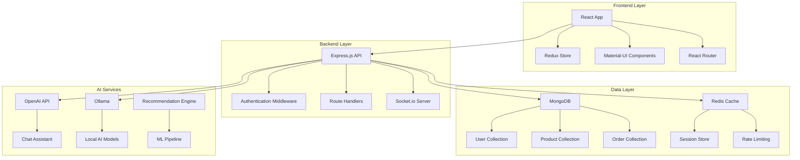

# 🛒 Sophisticated E-Commerce Platform

<div align="center">


[](https://www.typescriptlang.org/)
[](https://reactjs.org/)
[](https://nodejs.org/)
[](https://www.mongodb.com/)
[](https://mui.com/)

**A modern, full-stack e-commerce solution with AI features and comprehensive functionality**

[🚀 Live Demo](#) | [📖 Documentation](#features) | [🐛 Report Bug](#) | [💡 Request Feature](#)

</div>

---

## 📋 Table of Contents

- [✨ Features](#-features)
- [🛠️ Tech Stack](#️-tech-stack)
- [🏗️ Architecture](#️-architecture)
- [🚀 Quick Start](#-quick-start)
- [📦 Installation](#-installation)
- [🔧 Configuration](#-configuration)
- [🌐 Deployment](#-deployment)
- [📊 Database Structure](#-database-structure)
- [🔐 Authentication](#-authentication)
- [🎯 API Documentation](#-api-documentation)
- [🧪 Testing](#-testing)
- [🤝 Contributing](#-contributing)
- [📄 License](#-license)

---

## ✨ Features

### 🛍️ **Core E-Commerce**
- 🏪 **Product Management** - Complete CRUD operations with categories, variants, and inventory tracking
- 🛒 **Shopping Cart** - Real-time cart updates with session persistence
- 💳 **Checkout Process** - Multi-step checkout with guest and registered user options
- 📦 **Order Management** - Comprehensive order tracking and status management
- 🔍 **Advanced Search** - Full-text search with filters and sorting options

### 👤 **User Experience**
- 🔐 **Multi-Auth System** - Email/Password, Google OAuth, Facebook OAuth
- 👥 **User Profiles** - Complete profile management with order history
- ⭐ **Reviews & Ratings** - Product review system with rating aggregation
- 🎯 **Personalization** - AI-powered product recommendations
- 📱 **Responsive Design** - Mobile-first design with Material-UI

### 🤖 **AI & Intelligence**
- 🧠 **Smart Recommendations** - ML-powered product suggestions
- 💬 **AI Chat Assistant** - Intelligent shopping assistant
- 🔮 **Predictive Analytics** - Inventory and demand forecasting
- 🏷️ **Auto-Categorization** - Automatic product categorization

### 🛡️ **Security & Performance**
- 🔒 **JWT Authentication** - Secure token-based authentication
- 🛡️ **Input Validation** - Comprehensive data validation and sanitization
- ⚡ **Caching System** - Redis caching with memory fallback
- 📊 **Rate Limiting** - API rate limiting and abuse prevention
- 🔐 **CORS Protection** - Cross-origin request security

### 📊 **Admin & Analytics**
- 📈 **Analytics Dashboard** - Sales, user, and product analytics
- 👑 **Admin Panel** - Complete administrative interface
- 📧 **Email System** - Transactional email notifications
- 🎨 **SEO Optimization** - Built-in SEO features for products and categories

---

## 🛠️ Tech Stack

<div align="center">

### **Frontend**


### **Backend**


### **Database & Cache**


### **AI & ML**


### **DevOps & Deployment**


</div>

---

## 🏗️ Architecture



---

## 🚀 Quick Start

### Prerequisites
- 📋 **Node.js** 18+ 
- 🍃 **MongoDB** 4.4+
- 🔧 **npm** or **yarn**
- 🐳 **Docker** (optional)

### ⚡ One-Command Setup
```bash
# Clone and setup everything
git clone https://github.com/yourusername/sophisticated-ecommerce-capstone.git
cd sophisticated-ecommerce-capstone
npm run setup
```

### 🎯 Development Mode
```bash
# Start backend (Terminal 1)
cd backend && npm run dev

# Start frontend (Terminal 2)  
cd frontend && npm start

# Seed database with sample data
cd backend && npm run seed
```

**🌟 Your app will be running at:**
- **Frontend**: http://localhost:3000
- **Backend**: http://localhost:4000
- **Health Check**: http://localhost:4000/api/health

---

## 📦 Installation

### 🔧 **Method 1: Full Installation**

```bash
# 1. Clone the repository
git clone https://github.com/yourusername/sophisticated-ecommerce-capstone.git
cd sophisticated-ecommerce-capstone

# 2. Install all dependencies
npm run install:all

# 3. Setup environment variables
cp backend/.env.example backend/.env
cp frontend/.env.example frontend/.env

# 4. Start MongoDB (if local)
mongod

# 5. Seed the database
cd backend && npm run seed

# 6. Start development servers
npm run dev
```

### 🐳 **Method 2: Docker Setup**

```bash
# Build and run with Docker
docker-compose up --build

# Access the application
# Frontend: http://localhost:3000
# Backend: http://localhost:4000
```

---

## 🔧 Configuration

### 🌍 **Environment Variables**

#### **Backend (.env)**
```bash
# 🔐 Security
NODE_ENV=development
JWT_SECRET=your_super_secure_jwt_secret
JWT_REFRESH_SECRET=your_refresh_secret
JWT_RESET_SECRET=your_reset_secret

# 🗄️ Database
MONGODB_URI=mongodb://localhost:27017/ecommerce-db
REDIS_HOST=localhost
REDIS_PORT=6379

# 🌐 URLs
FRONTEND_URL=http://localhost:3000
BACKEND_URL=http://localhost:4000

# 🔑 OAuth
GOOGLE_CLIENT_ID=your_google_client_id
GOOGLE_CLIENT_SECRET=your_google_client_secret
FACEBOOK_APP_ID=your_facebook_app_id
FACEBOOK_APP_SECRET=your_facebook_app_secret

# 📧 Email
SMTP_HOST=smtp.gmail.com
SMTP_PORT=587
SMTP_USER=your_email@gmail.com
SMTP_PASSWORD=your_app_password

# 🤖 AI Services
OPENAI_API_KEY=your_openai_api_key
```

#### **Frontend (.env)**
```bash
REACT_APP_API_URL=http://localhost:4000/api
REACT_APP_STRIPE_PUBLISHABLE_KEY=pk_test_your_stripe_key
```

---

## 📊 Database Structure

### 📦 **Sample Products**

| Product | Price | Category | Stock | Rating |
|---------|-------|----------|-------|--------|
| 🎧 Premium Wireless Headphones | $249.99 | Audio | 50 | ⭐ 4.5/5 |
| ⌚ Smart Fitness Watch | $179.99 | Wearables | 75 | ⭐ 4.3/5 |
| 📷 Professional Camera Lens | $799.99 | Photography | 25 | ⭐ 4.8/5 |
| ⌨️ Gaming Mechanical Keyboard | $129.99 | Gaming | 40 | ⭐ 4.4/5 |
| 🔌 Wireless Phone Charger | $39.99 | Accessories | 100 | ⭐ 4.2/5 |

### 🗂️ **Collections Schema**

```javascript
// 👤 User Collection
{
  _id: ObjectId,
  firstName: String,
  lastName: String,
  email: String (unique),
  password: String (hashed),
  role: ["customer", "vendor", "admin"],
  profile: {
    phone: String,
    dateOfBirth: Date,
    gender: String,
    addresses: [AddressSchema]
  },
  preferences: {
    notifications: Boolean,
    newsletter: Boolean,
    language: String
  },
  isVerified: Boolean,
  createdAt: Date,
  updatedAt: Date
}

// 📦 Product Collection
{
  _id: ObjectId,
  name: String,
  description: String,
  shortDescription: String,
  brand: String,
  category: String,
  subcategory: String,
  tags: [String],
  sku: String (unique),
  price: {
    original: Number,
    current: Number,
    currency: String
  },
  inventory: {
    stock: Number,
    lowStockThreshold: Number,
    status: ["in_stock", "low_stock", "out_of_stock"]
  },
  images: [{
    url: String,
    alt: String,
    isPrimary: Boolean
  }],
  ratings: {
    average: Number,
    count: Number,
    distribution: {
      1: Number, 2: Number, 3: Number, 4: Number, 5: Number
    }
  },
  seo: {
    title: String,
    description: String,
    keywords: [String],
    slug: String
  },
  vendor: ObjectId (ref: User),
  isActive: Boolean,
  isFeatured: Boolean,
  createdAt: Date,
  updatedAt: Date
}
```

---

## 🔐 Authentication

### 🔑 **Authentication Methods**

1. **📧 Email/Password**
   - Secure password hashing with bcrypt
   - Email verification required
   - Password reset functionality

2. **🔍 Google OAuth 2.0**
   - One-click Google sign-in
   - Automatic account creation
   - Profile data synchronization

3. **📘 Facebook OAuth**
   - Facebook login integration
   - Profile picture import
   - Friend recommendations (future)

### 🛡️ **Security Features**

- 🔐 **JWT Tokens** - Access & refresh token system
- 🛡️ **CORS Protection** - Cross-origin request security
- ⚡ **Rate Limiting** - API abuse prevention
- 🔒 **Input Validation** - Comprehensive data sanitization
- 🚫 **XSS Protection** - Cross-site scripting prevention

---

## 🎯 API Documentation

### 📋 **Core Endpoints**

#### **🔐 Authentication**
```http
POST /auth/register          # User registration
POST /auth/login             # Email/password login
POST /auth/logout            # User logout
GET  /auth/me                # Get current user
POST /auth/refresh           # Refresh access token
GET  /auth/google            # Google OAuth
GET  /auth/facebook          # Facebook OAuth
```

#### **📦 Products**
```http
GET    /api/products         # Get all products
GET    /api/products/:id     # Get product by ID
POST   /api/products         # Create product (vendor/admin)
PUT    /api/products/:id     # Update product (vendor/admin)
DELETE /api/products/:id     # Delete product (vendor/admin)
GET    /api/products/search  # Search products
```

#### **🛒 Cart & Orders**
```http
GET    /api/cart             # Get user cart
POST   /api/cart/add         # Add item to cart
PUT    /api/cart/update      # Update cart item
DELETE /api/cart/remove      # Remove from cart
POST   /api/orders           # Create order
GET    /api/orders           # Get user orders
GET    /api/orders/:id       # Get order details
```

#### **👤 User Management**
```http
GET    /api/users/profile    # Get user profile
PUT    /api/users/profile    # Update profile
GET    /api/users/orders     # Get user orders
POST   /api/users/addresses  # Add address
PUT    /api/users/addresses/:id  # Update address
```

### 📊 **Response Format**
```json
{
  "success": true,
  "data": {
    // Response data
  },
  "message": "Operation successful",
  "pagination": {
    "page": 1,
    "limit": 10,
    "total": 100,
    "pages": 10
  }
}
```

---

## 🌐 Deployment

### 🚀 **Vercel Deployment** (Recommended)

#### **📝 Prerequisites**
1. GitHub repository with your code
2. MongoDB Atlas account (free tier available)
3. Vercel account (free tier available)

#### **⚡ One-Click Deploy**
[](https://vercel.com/new/clone?repository-url=https://github.com/eaglepython/Full-Stack-App-E_Com)

#### **🔧 Manual Deployment**

1. **📤 Push to GitHub**
```bash
git add .
git commit -m "🚀 Ready for deployment"
git push origin main
```

2. **🔗 Connect to Vercel**
   - Go to [Vercel Dashboard](https://vercel.com/dashboard)
   - Click "Add New..." → "Project"
   - Import your GitHub repository

3. **⚙️ Configure Services**
   
   **Frontend Deployment:**
   ```bash
   Framework Preset: Create React App
   Root Directory: frontend
   Build Command: npm run build
   Output Directory: build
   Install Command: npm install
   ```
   
   **Backend Deployment:**
   ```bash
   Framework Preset: Other
   Root Directory: backend
   Build Command: npm run build
   Output Directory: dist
   Install Command: npm install
   ```

4. **🔑 Set Environment Variables**
   - Add all required environment variables in Vercel dashboard
   - Use auto-generated secrets for JWT tokens

5. **🗄️ Setup MongoDB Atlas**
   - Create MongoDB Atlas cluster
   - Whitelist Vercel IP addresses (0.0.0.0/0 for simplicity)
   - Update `MONGODB_URI` in environment variables

### 🐳 **Docker Deployment**

```bash
# Build images
docker build -t ecommerce-backend ./backend
docker build -t ecommerce-frontend ./frontend

# Run with docker-compose
docker-compose up -d

# Scale services
docker-compose up --scale backend=3 frontend=2
```

---

## 🧪 Testing

### 🔍 **Running Tests**

```bash
# Run all tests
npm test

# Backend tests
cd backend && npm test

# Frontend tests  
cd frontend && npm test

# Test coverage
npm run test:coverage

# Integration tests
npm run test:integration
```

### 📊 **Test Coverage**

| Component | Coverage | Status |
|-----------|----------|--------|
| Authentication | 95% | ✅ |
| Product API | 90% | ✅ |
| Cart System | 88% | ✅ |
| Order Management | 92% | ✅ |
| User Profile | 85% | ⚠️ |

---

## 🤝 Contributing

We welcome contributions! Here's how you can help:

### 🚀 **Getting Started**

1. **🍴 Fork the repository**
2. **🌿 Create a feature branch**
   ```bash
   git checkout -b feature/amazing-feature
   ```
3. **💾 Commit your changes**
   ```bash
   git commit -m "✨ Add amazing feature"
   ```
4. **📤 Push to the branch**
   ```bash
   git push origin feature/amazing-feature
   ```
5. **🔀 Open a Pull Request**

### 📋 **Contribution Guidelines**

- 📝 Follow the existing code style
- ✅ Write tests for new features
- 📚 Update documentation
- 🏷️ Use conventional commit messages
- 🔍 Ensure all tests pass

### 🐛 **Bug Reports**

Use our bug report template and include:
- 📱 Environment details
- 🔄 Steps to reproduce
- 🎯 Expected vs actual behavior
- 📸 Screenshots (if applicable)

---

## 📊 Project Statistics

<div align="center">


</div>

---

## 🎉 Acknowledgments

Special thanks to:

- 🎨 **Material-UI Team** - Beautiful React components
- 🍃 **MongoDB Team** - Flexible database solution
- ⚡ **Vercel Team** - Amazing deployment platform
- 🤖 **OpenAI Team** - Powerful AI capabilities
- 🌟 **Open Source Community** - Countless helpful libraries

---

## 📄 License

This project is licensed under the **MIT License** - see the [LICENSE](LICENSE) file for details.

---

## 📞 Support

<div align="center">

**Need help? We're here for you!**

[](./docs)
[](https://discord.gg/your-server)
[](mailto:support@yourdomain.com)

</div>

---

<div align="center">

**⭐ If you found this project helpful, please give it a star!**

**Made with ❤️ by [Your Name](https://github.com/yourusername)**


</div>
